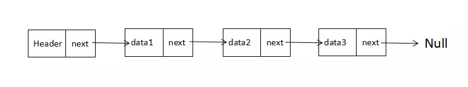
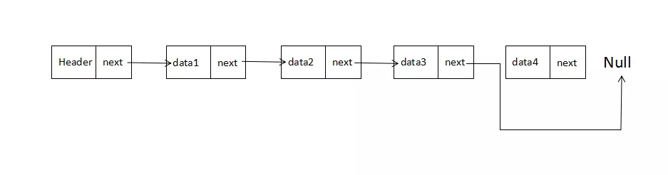

# 栈、队列

> 栈、队列进行存数数据，他们其实都是列表的一种，底层存储的数据的数据结构都是数组。

# 链表

数组不总是最佳的数据结构，因为，在很多编程语言中，数组的长度都是固定的，如果数组已被数据填满，再要加入新的元素是非常困难的。而且，对于数组的删除和添加操作，通常需要将数组中的其他元素向前或者向后平移，这些操作也是十分繁琐的。

然而，JS中数组却不存在上述问题，主要是因为他们被实现了成了对象，但是与其他语言相比（比如C或Java），那么它的效率会低很多。

链表其实有许多的种类：单向链表、双向链表、单向循环链表和双向循环链表。

### 单向链表

#### 链表结构图


链表是一组节点组成的集合，每个节点都使用一个对象的引用来指向它的后一个节点。

其中，data中保存着数据，next保存着下一个链表的引用。上图中，我们说 data2 跟在 data1 后面，而不是说 data2 是链表中的第二个元素。上图，值得注意的是，我们将链表的尾元素指向了 null 节点，表示链接结束的位置。

#### 有头节点的链表

由于链表的起始点的确定比较麻烦，因此很多链表的实现都会在链表的最前面添加一个特殊的节点，称为 头节点，表示链表的头部。进行改造，链表就成了如下的样子：



#### 插入节点

向链表中插入一个节点的效率很高，需要修改它前面的节点(前驱)，使其指向新加入的节点，而将新节点指向原来前驱节点指向的节点即可。下面我将用图片演示如何在 data2 节点 后面插入 data4 节点。


#### 删除节点

同样，从链表中删除一个节点，也很简单。只需将待删节点的前驱节点指向待删节点的，同时将待删节点指向null，那么节点就删除成功了。下面我们用图片演示如何从链表中删除 data4 节点。



# 链表的设计

我们设计链表包含两个类，一个是 Node 类用来表示节点，另一个事 LinkedList 类提供插入节点、删除节点等一些操作。


## Node类

Node类包含连个属性： element 用来保存节点上的数据，next 用来保存指向下一个节点的链接，具体实现如下：

```js
//节点
function Node(element) {
    this.element = element;   //当前节点的元素
    this.next = null;         //下一个节点链接
}
```

## LinkedList类

LinkedList类提供了对链表进行操作的方法，包括插入删除节点，查找给定的值等。值得注意的是，它只有一个
属性，那就是使用一个 Node 对象来保存该链表的头节点。

它的构造函数的实现如下：

```js
//链表类
function LList () {
    this.head = new Node( 'head' );     //头节点
    this.find = find;                   //查找节点
    this.insert = insert;               //插入节点
    this.remove = remove;               //删除节点
    this.findPrev = findPrev;           //查找前一个节点
    this.display = display;             //显示链表
}
```

head节点的next属性初始化为 null ，当有新元素插入时，next会指向新的元素。

接下来，我们来看看具体方法的实现。

### insert：向链表插入一个节点

我们先分析分析insert方法，想要插入一个节点，我们必须明确要在哪个节点的前面或后面插入。我们先来看看，如何在一个已知节点的后面插入一个节点。
在一个已知节点后插入新节点，我们首先得找到该节点，为此，我们需要一个 find 方法用来遍历链表，查找给定的数据。如果找到，该方法就返回保存该数据的节点。那么，我们先实现 find 方法。

```js
//查找给定节点

function find ( item ) {
    var currNode = this.head;
    while ( currNode.element != item ){
        currNode = currNode.next;
    }
    return currNode;
}
```


# 参考文档

- [JS中的算法与数据结构——链表(Linked-list)](https://www.jianshu.com/p/f254ec665e57)