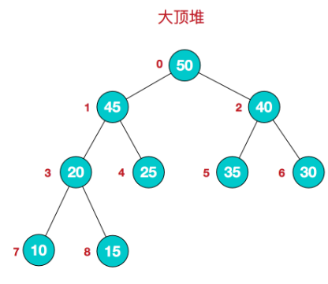
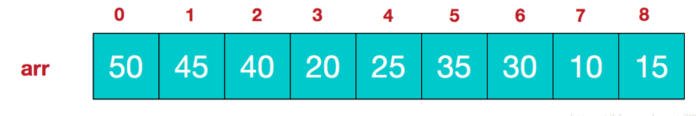

# 堆

- 堆的底层实际上是一棵完全二叉树。
- 可以用数组实现
- 每个的节点元素值不小于其子节点 - 最大堆
- 每个的节点元素值不大于其子节点 - 最小堆

# 堆的构建

## 大顶堆

从第一个非叶子节点开始依次对数组中的元素进行下沉操作

和孩子节点的最大值max比较
大于max — 不需要在下沉
小于max — 和max交换位置 - 继续和下一层孩子节点比较，直到队列末尾

## 小顶堆

从第一个非叶子节点开始依次对数组中的元素进行下沉操作

和孩子节点的最小值min比较
小于min — 不需要在下沉
大于min — 和min交换位置（下沉） - 继续和下一层孩子节点比较，直到队列末尾

## 参考文档

- [JS实现堆排序](https://segmentfault.com/a/1190000015487916?utm_source=tag-newest)

