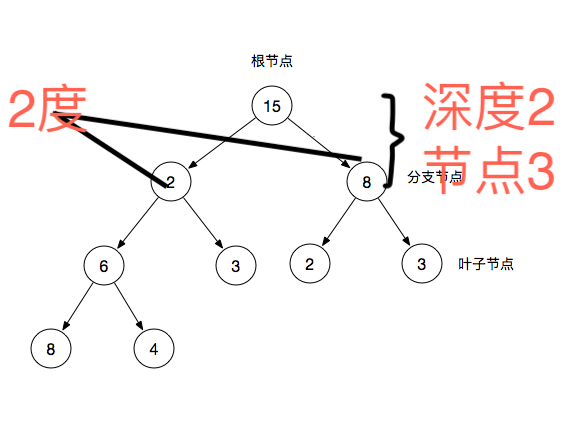
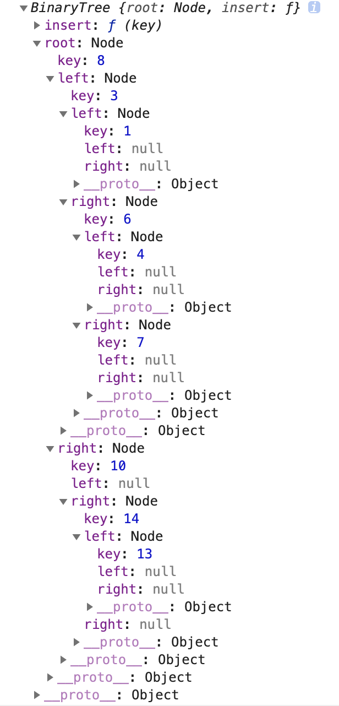

# 度，节点和深度

结点所拥有的子树的个数称为该结点的度(Degree); 树中各结点度的最大值称为该树的度； 称度为m的树为m叉树。

也就是说二叉树的度为2，三叉树的度为3

- 树中结点的最大度数没有限制，而二叉树结点的最大度数为2；

- 树的结点无左、右之分，而二叉树的结点有左、右之分。

|树|度|
|-|-|
|二叉树|2|
|三叉树|3|
|四叉树|4|
|n叉树|n|

二叉树中每个元素都称为节点。
多少个元素多少节点。
根节点就是深度1，后面每一层加1。



- 根节点：二叉树最顶层的节点
- 分支节点：除了根节点以外且拥有叶子节点
- 叶子节点：除了自身，没有其他子节点

## 二叉树的三个性质

- 在二叉树的第i层上，至多有`2^i-1`个节点
    - i=1时，只有一个根节点，2^(i-1) = 2^0 = 1

- 深度为k的二叉树至多有2^k-1个节点
    - i=2时，2^k-1 = 2^2 - 1 = 3个节点

- 对任何一棵二叉树T，如果总结点数为n0，度为2(子树数目为2)的节点数为n2,则n0=n2+1

## 树和二叉树的三个主要差别

- 树的节点个数至少为1，而二叉树的节点个数可以为0
- 树中节点的最大度数(节点数量)没有限制,而二叉树的节点的最大度数为2
- 树的节点没有左右之分，而二叉树的节点有左右之分

## 二叉树分类

- 满二叉树：一棵深度为k且有2^k - 1个节点的二叉树称为满二叉树
- 完全二叉树：完全二叉树是指最后一层左边是满的，右边可能满也可能不满，然后其余层都是满的二叉树称为完全二叉树(满二叉树也是一种完全二叉树)

## 排序二叉树

左子树小于根节点，右子树大于根节点，子树也满足这样的条件，这样的树叫做排序二叉树。
```js
function BinaryTree() {
    // 节点
    var Node = function (key) {
        // 节点值
        this.key = key;
        // 左叶子
        this.left = null;
        // 右叶子
        this.right = null;
    };
    // 根节点
    this.root = null;
    // 插入节点
    var insertNode = function (node, newNode) {
        // 对比值 新值小于根(该)节点值，放左边
        if (newNode.key < node.key) {
            // 左边如果为空直接放入
            if (node.left === null) {
                node.left = newNode;
            // 左边如果不为空把节点取出来继续往下面对比
            } else {
                insertNode(node.left, newNode);
            }
        } else {
            if (node.right === null) {
                node.right = newNode;
            } else {
                insertNode(node.right, newNode);
            }
        }
    };
    this.insert = function (key) {
        // 创建节点
        var newnode = new Node(key);
        // 如果this.root为空，也就是第一个为根节点，否则插入节点
        if (this.root === null) {
            this.root = newnode;
        } else {
            insertNode(this.root, newnode);
        }
    };
}

// 数组存放没放入排序二叉树的节点
var nodes = [8, 3, 10, 1, 6, 14, 4, 7, 13];
var binaryTree = new BinaryTree;
nodes.forEach(function (key) {
    binaryTree.insert(key);
});
console.log(binaryTree);
```

数据结构



# 遍历

- 中序遍历(inorder)：先遍历左节点，再遍历自己，最后遍历右节点，输出的刚好是**有序的列表**是一种排序方案
- 前序遍历(preorder)：先自己，再遍历左节点，最后遍历右节点
- 后序遍历(postorder)：先左节点，再右节点，最后自己

